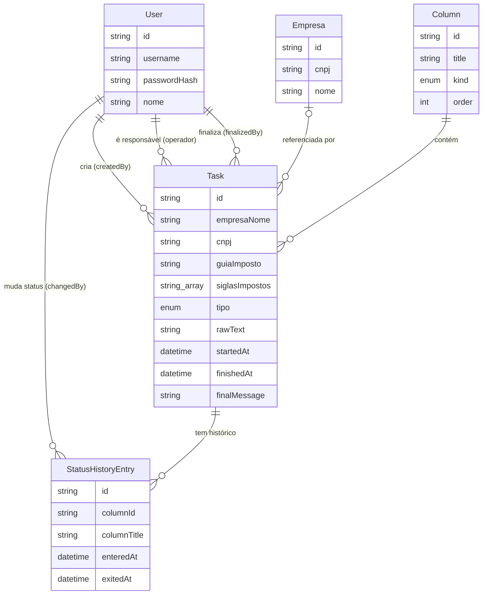

# Modelo de Dados

← [[00 - Índice]] · Ver também [[02 - Arquitetura]]

Schema definido em `server/prisma/schema.prisma`. Todas as tabelas usam `id` do tipo UUID.

## Diagrama de relacionamento

## Tabelas

### `User` (usuários / operadores)
Cada pessoa da equipe tem uma conta própria. **É a mesma entidade que "operador"** — não existe mais um cadastro de operador separado de login (ver [[12 - Histórico de Decisões]]).

| Campo | Tipo | Observação |
|---|---|---|
| `username` | string, único | login (minúsculo) |
| `passwordHash` | string | bcrypt, nunca a senha em texto puro |
| `nome` | string | nome de exibição |

### `Empresa` (cadastro de empresas)
Base de CNPJ + Nome usada pra identificar automaticamente a empresa no texto colado ao criar uma demanda. Ver [[07 - Cadastro de Empresas]].

### `Column` (colunas do Kanban)
Fixas hoje, semeadas por `server/prisma/seed.ts`:

| id | título | kind |
|---|---|---|
| `fila` | Fila | `queue` |
| `andamento` | Em Andamento | `active` |
| `revisao` | Revisão | `active` |
| `concluido` | Concluído | `done` |

O campo `kind` controla comportamento (ver [[05 - Quadro Kanban e Cronômetro]]):
- `queue` — ainda não iniciada, cronômetro parado.
- `active` — cronômetro rodando (primeira vez que a tarefa entra numa coluna `active`, grava `startedAt`).
- `done` — dispara a tela de finalização.

### `Task` (demanda)
A entidade central. Campos importantes:

| Campo | Observação |
|---|---|
| `empresaNome`, `cnpj`, `empresaId` | `empresaId` é opcional — só é preenchido quando a empresa foi encontrada no cadastro; `empresaNome`/`cnpj` ficam gravados direto na tarefa mesmo assim (histórico não depende do cadastro não ser editado depois) |
| `guiaImposto` | Código(s) da Receita, ex: `2089-01, 2372-01` |
| `siglasImpostos` | array de siglas, ex: `["IRPJ", "CSLL"]` |
| `tipo` | `compensacao` \| `ressarcimento` |
| `rawText` | o texto original colado — guardado pra auditoria |
| `createdById` | **quem criou** — sempre o usuário autenticado, nunca um campo enviado pelo cliente |
| `operadorId` | quem está designado a trabalhar a demanda (escolhido num dropdown ao criar) |
| `startedAt` / `finishedAt` | preenchidos automaticamente pelas regras do Kanban |
| `finalMessage` | a mensagem final gerada (Bitrix) |
| `finalizedById` | quem confirmou a finalização |

### `StatusHistoryEntry` (histórico de status)
Uma linha por passagem da tarefa por uma coluna. Registra `enteredAt`/`exitedAt` e **`changedById`** — sempre o usuário autenticado que fez a ação, nunca informação vinda do front. É essa tabela que permite responder "quanto tempo ficou em cada etapa" e "quem moveu pra onde".

### `Notification`
Log de eventos (`created`, `moved`, `finalized`) com mensagem pronta pra exibir. Hoje é **global** — todo mundo vê a notificação de toda demanda, não só a das suas próprias tarefas (ver limitação em [[13 - Pendências e Próximos Passos]]).

## Regra de ouro do schema

> Nenhum campo de "quem fez a ação" (`createdById`, `changedById`, `finalizedById`) é aceito vindo do cliente. Todos são preenchidos no backend a partir do usuário autenticado na sessão. Essa é a base técnica que sustenta "provar quem fez o quê" — ver [[04 - Autenticação e Usuários]] e [[11 - Segurança]].
