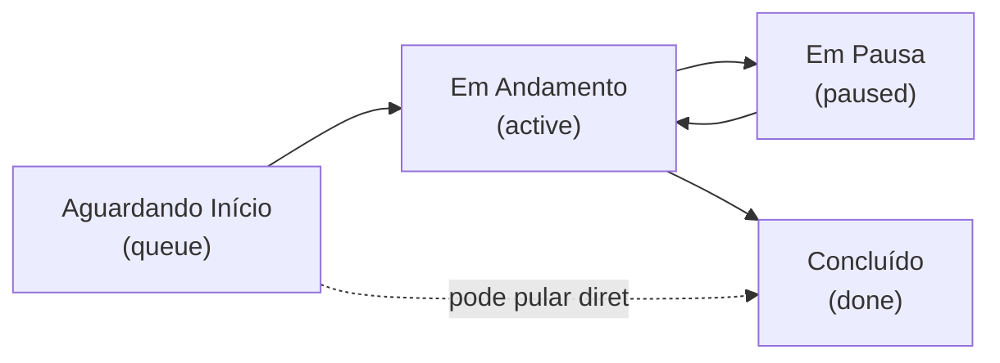

# Quadro Kanban e Cronômetro

← [[00 - Índice]] · Ver também [[03 - Modelo de Dados]] · [[14 - Prioridade e Pausa com Gestor]]

## As colunas

Nomes atualizados (renomeados de "Fila" e "Revisão" — ver [[12 - Histórico de Decisões]]). O quadro permite mover uma tarefa pra **qualquer** coluna, em qualquer ordem (não é uma esteira travada) — o usuário arrasta o card livremente. As colunas têm um "tipo" (`kind`) que determina o comportamento automático:

- **`queue`** (Aguardando Início) — estado inicial, cronômetro parado.
- **`active`** (Em Andamento) — cronômetro rodando. Assim que a tarefa sai de `queue` **pela primeira vez** (pra `active`, `paused` ou `done`), o campo `startedAt` é gravado — essa é também a hora em que a checagem de prioridade decide se a tarefa pode ser iniciada (ver [[14 - Prioridade e Pausa com Gestor]]).
- **`paused`** (Em Pausa) — cronômetro **pausado de verdade**: o tempo passado aqui não entra na conta do tempo trabalhado. Exige informar um motivo, que vira notificação pro gestor.
- **`done`** (Concluído) — ao entrar aqui, abre automaticamente o modal de finalização (ver [[08 - Finalização e Mensagem Bitrix]]).

## Cronômetro por segmentos (não é só `finishedAt - startedAt`)

O tempo trabalhado **soma só os períodos em que a tarefa esteve numa coluna `active`**, ignorando qualquer período em `paused`. Isso é calculado no frontend (`computeElapsedMs` em `src/lib/time.ts`) percorrendo o histórico de status e somando `exitedAt - enteredAt` (ou `agora - enteredAt` se ainda estiver aberto) só das entradas com `columnKind === "active"`.

Exemplo real testado: tarefa entra em Andamento (2s) → pausada com motivo (2s, não conta) → volta pra Andamento (contando de novo). Tempo trabalhado mostrado: só os 2s + 2s dos períodos ativos, os 2s da pausa ficam de fora.

## Histórico de status (a base do "quanto tempo levou")

Cada vez que uma tarefa muda de coluna, o backend:
1. Fecha a entrada de histórico atual (`exitedAt = agora`).
2. Cria uma nova entrada (`columnId`, `columnTitle`, `columnKind`, `enteredAt = agora`, `changedById = usuário autenticado`, e `motivo` se for uma pausa).
3. Se a coluna de destino não é `queue` e a tarefa nunca tinha sido iniciada, grava `startedAt`.

Isso é feito numa transação Prisma (`server/src/routes/tasks.ts`, rota `PATCH /api/tasks/:id/move`), junto com o recálculo da ordem (`order`) de todas as tarefas da coluna de destino e a checagem de bloqueio por prioridade (ver [[14 - Prioridade e Pausa com Gestor]]).

O card mostra o tempo trabalhado **ao vivo** (atualiza a cada segundo, via hook `useTicker`), congelando durante uma pausa.

## Cancelar uma finalização

Se o usuário abre o modal de finalização (arrastou pra "Concluído") e clica em **Cancelar**, a tarefa **volta pra coluna anterior** — isso gera uma nova entrada no histórico (a "ida e volta" fica registrada, é auditável), sem apagar nada.

## Onde está o código
- `src/components/KanbanBoard.tsx` — orquestra o drag-and-drop (`@dnd-kit`), decide coluna/posição de destino, intercepta movimentos pra "Em Pausa" (abre [[14 - Prioridade e Pausa com Gestor|modal de motivo]]).
- `src/components/Column.tsx` / `TaskCard.tsx` — visual das colunas e cards (com selo de prioridade e "Pausada").
- `src/lib/time.ts` — `computeElapsedMs`, o cálculo de tempo por segmentos ativos.
- `server/src/routes/tasks.ts` — lógica de mover, histórico, cronômetro, bloqueio (backend, fonte da verdade).

## Limitação conhecida
Não há atualização otimista: depois de soltar um card, ele "volta" visualmente até a resposta do servidor confirmar o movimento (rápido, mas não instantâneo). Movimentos de **outras pessoas** aparecem via o mecanismo de notificação em tempo real (ver [[09 - Notificações em Tempo Real]]).
