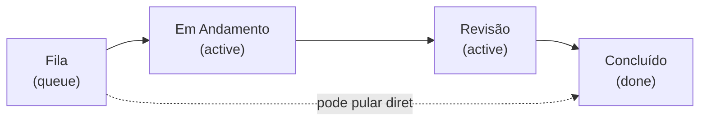

# Quadro Kanban e Cronômetro

← [[00 - Índice]] · Ver também [[03 - Modelo de Dados]]

## As colunas

O quadro permite mover uma tarefa pra **qualquer** coluna, em qualquer ordem (não é uma esteira travada) — o usuário arrasta o card livremente. As colunas têm um "tipo" (`kind`) que determina o comportamento automático:

- **`queue`** (Fila) — estado inicial, cronômetro parado.
- **`active`** (Em Andamento, Revisão) — cronômetro rodando. Assim que a tarefa entra numa coluna `active` **pela primeira vez**, o campo `startedAt` é gravado. Entrar de novo numa coluna `active` depois não reinicia o cronômetro.
- **`done`** (Concluído) — ao entrar aqui, abre automaticamente o modal de finalização (ver [[08 - Finalização e Mensagem Bitrix]]).

## Histórico de status (a base do "quanto tempo levou")

Cada vez que uma tarefa muda de coluna, o backend:
1. Fecha a entrada de histórico atual (`exitedAt = agora`).
2. Cria uma nova entrada (`columnId`, `columnTitle`, `enteredAt = agora`, `changedById = usuário autenticado`).
3. Se a coluna de destino é `active` e a tarefa nunca tinha sido iniciada, grava `startedAt`.

Isso é feito numa transação Prisma (`server/src/routes/tasks.ts`, rota `PATCH /api/tasks/:id/move`), junto com o recálculo da ordem (`order`) de todas as tarefas da coluna de destino — pra manter a posição visual consistente entre os usuários.

O card mostra o tempo decorrido **ao vivo** (atualiza a cada segundo, via hook `useTicker`) enquanto a tarefa está numa coluna ativa e ainda não foi finalizada.

## Cancelar uma finalização

Se o usuário abre o modal de finalização (arrastou pra "Concluído") e clica em **Cancelar**, a tarefa **volta pra coluna anterior** — isso gera uma nova entrada no histórico (a "ida e volta" fica registrada, é auditável), sem apagar nada.

## Onde está o código
- `src/components/KanbanBoard.tsx` — orquestra o drag-and-drop (`@dnd-kit`), decide coluna/posição de destino.
- `src/components/Column.tsx` / `TaskCard.tsx` — visual das colunas e cards.
- `server/src/routes/tasks.ts` — lógica de mover, histórico, cronômetro (backend, fonte da verdade).

## Limitação conhecida
O quadro **não atualiza instantaneamente durante o arraste de outra pessoa** — só depois que a ação termina, via o mesmo mecanismo de notificação em tempo real (ver [[09 - Notificações em Tempo Real]]). Também não há atualização otimista: depois de soltar um card, ele "volta" visualmente até a resposta do servidor confirmar o movimento (rápido, mas não instantâneo).
