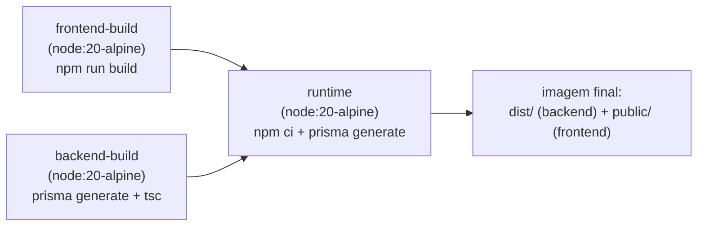

# Infraestrutura e Deploy

← [[00 - Índice]] · Ver também [[02 - Arquitetura]] · [[11 - Segurança]]

## Onde roda

Numa VPS Linux já existente do usuário, que também hospeda outros serviços (Umami — analytics; Waha — WhatsApp HTTP API). O sistema foi propositalmente isolado desses outros serviços: rede Docker própria, volume de banco próprio, sem reaproveitar nenhum container já existente.

## Containers (Docker Compose)

Arquivo: `docker-compose.yml` na raiz do projeto.

| Serviço | Imagem | Porta exposta | Volume | Restart |
|---|---|---|---|---|
| `demandas-db` | `postgres:15-alpine` | `127.0.0.1:5433` (só local, não pública) | `demandas-db-data` | `unless-stopped` |
| `demandas-api` | build próprio (`server/Dockerfile`) | `0.0.0.0:5173` → `4000` interno | — (stateless) | `unless-stopped` |

```bash
# subir tudo
docker compose up -d

# reconstruir a API depois de mudar código
docker compose build demandas-api
docker compose up -d demandas-api

# ver logs
docker compose logs demandas-api --tail 50 -f

# status
docker compose ps
```

### Por que sobrevive a reinício da VPS
- `restart: unless-stopped` — os containers voltam sozinhos se caírem ou se o Docker reiniciar.
- O serviço `docker` do sistema está habilitado pra iniciar no boot (`systemctl is-enabled docker` → `enabled`).
- Junto, isso significa: **reiniciar a VPS não exige nenhuma ação manual** pra o site voltar ao ar.

## O Dockerfile (`server/Dockerfile`) — build multi-stage



1. **frontend-build** — instala dependências do React, roda `npm run build` (Vite) → gera `dist/`.
2. **backend-build** — instala dependências do backend, gera o Prisma Client, compila TypeScript → gera `dist/`.
3. **runtime** — imagem final enxuta: instala dependências de produção do backend, copia o `dist/` compilado e o `dist/` do frontend (renomeado pra `public/`), regenera o Prisma Client (garante binário compatível com o Alpine da imagem final).

Ao iniciar, o container roda `npx prisma migrate deploy` (aplica migrações pendentes automaticamente) e só depois `node dist/index.js`.

## Variáveis de ambiente (`.env`, não versionado)

| Variável | Uso |
|---|---|
| `POSTGRES_PASSWORD` | senha real do Postgres (usada pelo container `demandas-db`) |
| `POSTGRES_PASSWORD_ENCODED` | mesma senha, URL-encoded (usada na `DATABASE_URL` do Prisma) |
| `JWT_SECRET` | chave de assinatura dos tokens de sessão |

Existe também `server/.env`, só pra rodar comandos Prisma **fora** do Docker, apontando pro Postgres via a porta exposta em `127.0.0.1:5433`.

## Migrações de banco

```bash
cd server
npx prisma migrate dev --name descricao_da_mudanca   # cria + aplica localmente
```

Em produção, a migração roda sozinha no boot do container (`prisma migrate deploy`), então normalmente não precisa de passo manual — só gerar a migração localmente e fazer o rebuild da imagem.

## Rede pública

O site é acessado direto pelo IP da VPS: `http://187.77.49.158:5173`. É **HTTP puro, sem certificado** — implicações disso em [[11 - Segurança]].
