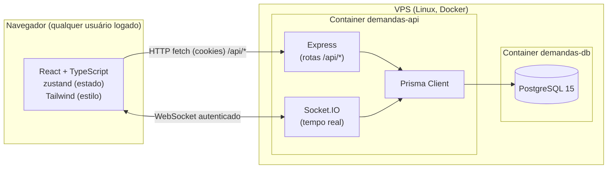

# Arquitetura

← [[00 - Índice]]

## Visão geral



Tudo roda atrás de uma única porta pública (`5173`), que o Docker mapeia pra porta interna `4000` do container `demandas-api`. Esse mesmo processo Express:
- serve os arquivos estáticos do frontend (build do Vite);
- responde as rotas `/api/*`;
- mantém as conexões WebSocket (Socket.IO) pra notificações em tempo real.

Isso evita problema de CORS (front e API são "a mesma origem" do ponto de vista do navegador) e simplifica o deploy — só uma porta pra abrir/expor.

## Camadas

### 1. Frontend (React)
- **Vite** como bundler/dev server.
- **Zustand** pra estado global (duas stores principais: `useAuthStore` pro usuário logado, `useAppStore` pros dados do sistema — tarefas, colunas, empresas, operadores, notificações).
- **@dnd-kit** pro drag-and-drop do quadro Kanban.
- **Tailwind CSS v4** pro estilo.
- Não guarda mais nada em `localStorage` — todo dado vem da API, com uma exceção pontual (`src/lib/lastSeen.ts`, só a marca de "última vez que a aba esteve em foco", usada pra decidir quais cards piscam — ver [[09 - Notificações em Tempo Real]]). Ver [[12 - Histórico de Decisões]] pra entender a mudança original.
- `src/lib/sped/` e `src/lib/perdcomp/` — processamento de SPED e PER/DCOMP, **inteiramente no navegador** (o backend nunca vê esses arquivos). Ver [[16 - SPED Retificador]] e [[17 - Compensação via PER-DCOMP]].

### 2. Backend (Node.js + Express)
- Rotas REST em `/api/*` (auth, users, empresas, tasks, notifications, columns).
- **Prisma** como ORM, contra PostgreSQL.
- **JWT** em cookie `httpOnly` pra sessão (ver [[04 - Autenticação e Usuários]]).
- **Socket.IO** anexado ao mesmo servidor HTTP, autenticado pelo mesmo cookie de sessão (ver [[09 - Notificações em Tempo Real]]).

### 3. Banco de dados (PostgreSQL)
- Container **dedicado** (`demandas-db`), isolado dos outros serviços que já rodam na mesma VPS (Umami, Waha) — rede Docker própria, volume próprio.
- Dados gravados em volume Docker persistente (`demandas-db-data`), sobrevive a reinício de container.
- Acesso administrativo disponível só em `127.0.0.1:5433` (não exposto publicamente) — só o próprio container `demandas-api` fala com ele via rede interna Docker (`demandas-db:5432`).

Ver estrutura completa das tabelas em [[03 - Modelo de Dados]].

## Onde cada coisa mora no disco (VPS)

```
/root/gerenciador-demandas/
├── src/                  → frontend (React)
├── server/
│   ├── src/              → backend (Express)
│   ├── prisma/
│   │   ├── schema.prisma → modelo de dados
│   │   ├── migrations/   → histórico de mudanças no banco
│   │   └── seed.ts       → cria colunas padrão + primeiro usuário
│   └── Dockerfile        → build multi-stage (frontend + backend)
├── docker-compose.yml    → orquestra os dois containers
└── .env                  → segredos (senha do Postgres, JWT_SECRET) — NÃO versionado
```

Deploy completo em [[10 - Infraestrutura e Deploy]].
