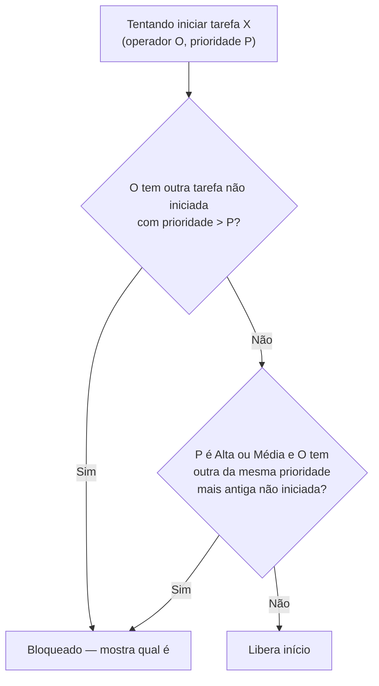

# Prioridade e Pausa com Gestor

← [[00 - Índice]] · Ver também [[05 - Quadro Kanban e Cronômetro]] · [[06 - Criação de Demandas]] · [[03 - Modelo de Dados]]

## Urgência (prioridade) da demanda

Toda demanda recebe uma prioridade ao ser criada: **Baixa**, **Média** ou **Alta** (campo `prioridade`, editável depois dentro da tarefa). Isso não é só um rótulo — controla **quem pode ser iniciado antes de quem**.

### Regra de bloqueio — a fila é por operador

Pra iniciar uma tarefa (sair de "Aguardando Início" pela primeira vez), o backend verifica, **só entre as tarefas do mesmo operador** da tarefa sendo iniciada:

1. **Entre níveis diferentes:** não dá pra iniciar uma tarefa se existir outra tarefa **do mesmo operador**, **não iniciada**, de prioridade **maior**. Alta bloqueia Média e Baixa; Média bloqueia Baixa.
2. **Dentro do mesmo nível — só pra Alta e Média:** tem que iniciar a **mais antiga** primeiro (FIFO por `createdAt`), sempre dentro do mesmo operador. Se esse operador tiver duas tarefas Alta não iniciadas, a mais nova fica bloqueada até a mais antiga ser iniciada.
3. **Baixa não tem regra de ordem entre si** — várias tarefas Baixa (do mesmo operador) podem ser iniciadas em qualquer ordem, desde que não haja Alta/Média pendente dele (regra 1 ainda vale).

Se bloqueado, a API responde `409` com a tarefa que precisa ser iniciada primeiro (`blockingTask`), e o frontend mostra essa informação no erro.

> [!bug] Bug real: fila era global, não por operador
> Na primeira versão, a checagem considerava **todas** as tarefas do sistema — uma demanda Alta atribuída à pessoa A bloqueava a pessoa B de iniciar uma demanda Baixa dela, mesmo sem nenhuma relação entre as duas. Relatado com um caso concreto ("tenho uma Alta pro Espedito e uma Baixa pra mim, o sistema me bloqueia por causa da dele"). Corrigido filtrando a consulta de tarefas candidatas por `operadorId` — cada operador tem sua própria fila de prioridade, independente das dos outros.

### Alerta visual

O quadro mostra uma faixa vermelha no topo com a tarefa de prioridade Alta/Média mais antiga ainda não iniciada **do usuário logado** (`findMostUrgentPending` em `src/lib/priority.ts`, filtrado por `operadorId === usuário atual` antes de chamar) — visível sempre, não só quando alguém tenta furar a fila. Filtrado por usuário pelo mesmo motivo do bug acima: mostrar a demanda urgente de outra pessoa não ajuda (e confunde) quem está vendo o quadro.

### Onde está o código
- `server/src/routes/tasks.ts` — função `findBlockingTask`, chamada na rota `PATCH /api/tasks/:id/move` antes de qualquer movimento que "inicie" a tarefa.
- `src/lib/priority.ts` — ranking (`PRIORITY_RANK`) e `findMostUrgentPending` (banner).
- `src/components/KanbanBoard.tsx` — exibe o banner.
- `src/components/NewTaskModal.tsx` / `TaskDetailsModal.tsx` — seleção e edição da prioridade.

## Pausa com motivo obrigatório

Ao mover uma demanda pra **Em Pausa** (`kind: paused`), o sistema abre um modal pedindo o **motivo** — campo obrigatório, a API rejeita (`400`) uma pausa sem motivo. O motivo fica gravado na entrada de histórico daquela pausa (`StatusHistoryEntry.motivo`), visível depois nos detalhes da tarefa.

Cancelar o modal significa que a tarefa **nunca chega a ser movida** (nenhuma chamada à API acontece) — diferente do fluxo de finalização, que move e só depois permite reverter.

## Papel de gestor

Usuários podem ser marcados como **gestor** (`User.isGestor`, checkbox na tela Usuários). Isso não muda o que eles conseguem fazer no sistema — só controla quem recebe uma notificação específica:

- Toda pausa gera uma notificação **global** genérica ("Empresa X movida para Em Pausa"), que todo mundo vê, igual às outras.
- Toda pausa **também** gera uma notificação **direcionada só pros gestores**, com o motivo completo ("Empresa X foi pausada: [motivo]") — usuários sem `isGestor` não veem essa segunda notificação.

### Como a entrega direcionada funciona
- `Notification.recipientUserId` — quando `null`, é global; quando preenchido, só aquele usuário vê (via `GET /api/notifications`, que filtra `recipientUserId IS NULL OR = usuário atual`).
- Em tempo real: cada usuário conectado entra numa "sala" própria no Socket.IO (`user:<id>`) ao autenticar; notificações direcionadas são emitidas só nessa sala (`notifyUser`), não em broadcast — ver [[09 - Notificações em Tempo Real]].

### Onde está o código
- `server/src/routes/notifications.ts` — `pushNotificationToUsers`, `notifyGestores`.
- `server/src/socket.ts` — `notifyUser`, sala por usuário.
- `src/components/PauseReasonModal.tsx` — o modal de motivo.
- `src/components/UsersModal.tsx` — checkbox "É gestor".

## Testes feitos (validado ponta a ponta)
- Duas tarefas Alta do mesmo operador: iniciar a mais nova é bloqueado; iniciar a mais antiga libera; depois a mais nova pode ser iniciada.
- Tarefa Baixa é bloqueada enquanto existir Alta pendente do mesmo operador, mesmo que a Alta tenha sido criada depois da Baixa.
- Tarefa Alta de um operador **não** bloqueia uma tarefa Baixa de outro operador (cenário do bug acima, reproduzido e confirmado corrigido).
- Pausa sem motivo retorna `400`; com motivo, sucede.
- Usuário sem `isGestor` não recebe a notificação com o motivo; usuário gestor recebe.
- Cronômetro: períodos em pausa corretamente excluídos do tempo trabalhado (ver [[05 - Quadro Kanban e Cronômetro]]).
